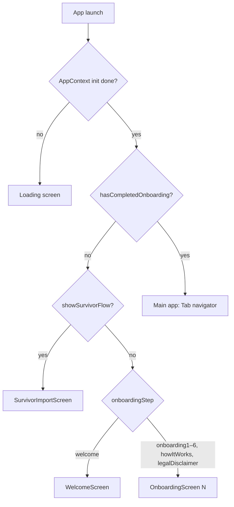
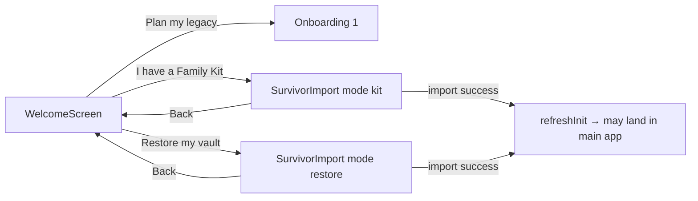
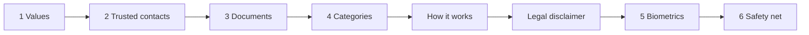
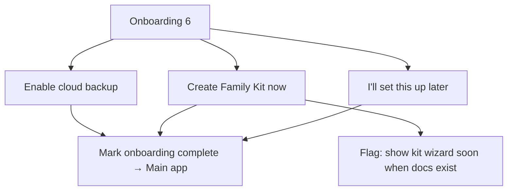
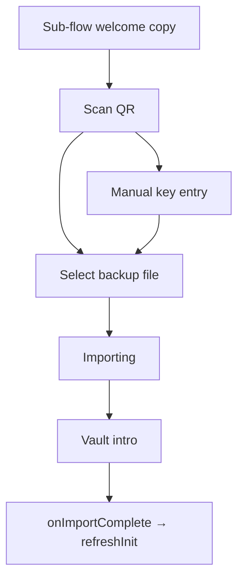
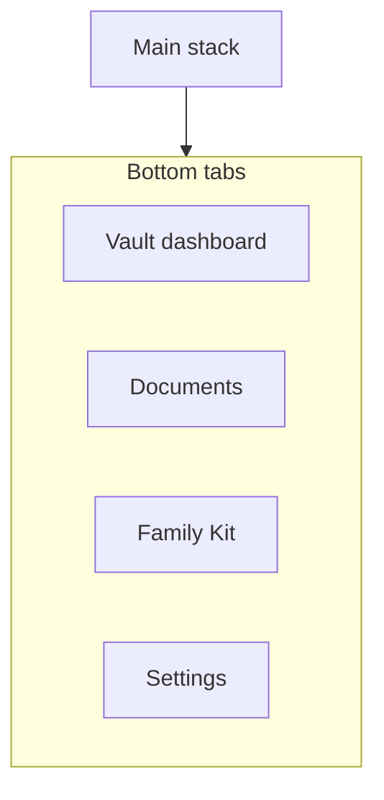
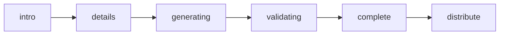

# After Me — user journey & routes (implementation map)

This document reflects **current app navigation** in `after-me-mobile` so you can rework flows with a single source of truth. View diagrams in [GitHub](https://github.com), [Mermaid Live Editor](https://mermaid.live), or a VS Code Mermaid extension.

---

## 1. Cold start → first meaningful screen

---

## 2. Welcome — three entry paths

From **Welcome**, the user picks one branch (each can use **Back** where noted).

**Note:** `SurvivorImportScreen` uses the same internal steps for both modes; `mode` is passed for context (implementation detail).

---

## 3. “Plan my legacy” — linear onboarding (with Back)

Order is fixed in `AppNavigator`. **Back** on each step (except welcome) returns to the previous step.

| Step key            | Screen        | Typical purpose                          |
| ------------------- | ------------- | ---------------------------------------- |
| `welcome`           | Welcome       | Choose path                              |
| `onboarding1`       | Onboarding 1  | Values / motivation                      |
| `onboarding2`       | Onboarding 2  | Trusted contacts                         |
| `onboarding3`       | Onboarding 3  | Documents intro                          |
| `onboarding4`       | Onboarding 4  | Category selection                       |
| `howItWorks`        | How it works  | Product explanation                      |
| `legalDisclaimer`   | Legal         | Disclaimer acceptance                    |
| `onboarding5`       | Onboarding 5  | Biometric lock                           |
| `onboarding6`       | Onboarding 6  | Safety net (cloud backup / kit / defer)  |

After **Onboarding 6** completes, `hasCompletedOnboarding` is set and the user enters the **main tab navigator**.

---

## 4. Onboarding 6 — safety net outcomes

---

## 5. Survivor / import flow (internal steps)

Users can navigate between scan / manual / file paths per screen actions (see `SurvivorImportScreen`).

---

## 6. Main app — bottom tabs

**Navigation note:** The root stack only hosts **Main** (tabs). From **Vault**, “Review documents” / category taps switch to the **Documents** tab via `navigate('Documents')`, with an optional **category filter** set in app context first. First tab in the navigator is **Vault** (Dashboard).

---

## 7. Overlays & modals (cross-cutting)

These sit **on top of** tabs or onboarding; they are not separate stack routes unless noted.

| Entry area        | Overlay / route              | Trigger examples                                      |
| ----------------- | ---------------------------- | ----------------------------------------------------- |
| Vault             | `KitCreationWizard` modal    | Safety-net banner, stale-kit banner, post-onboarding “create kit now” when `totalDocuments > 0` |
| Vault             | Switch to **Documents** tab  | “Review documents” / category chip; may set `categoryFilter` in context |
| Documents         | `AddDocumentModal`           | Add document                                          |
| Documents         | `PaywallScreen`              | Document limit reached                                |
| Documents         | `DocumentViewerModal`        | Open document                                         |
| Documents         | Rename modal                 | Rename document                                       |
| Family Kit tab    | `PaywallScreen`              | Non-premium taps primary action (`family_kit`)        |
| Family Kit tab    | `KitCreationWizard`          | Premium: create kit                                   |
| Settings          | `KitCreationWizard`          | Create / refresh kit actions                        |
| Settings          | Kit history modal → wizard   | Open existing kit, refresh                            |
| Settings          | `PaywallScreen`              | Upgrade / family kit / settings triggers              |
| Settings          | `PersonalRecoveryWizard`     | Personal recovery                                     |
| Settings          | Vault switcher modal         | Switch vault                                          |
| Settings          | Help modal                   | Help                                                  |
| Settings          | Phase 1 screen (`__DEV__`)   | Developer entry                                       |

**Product note:** `KitCreationWizard` does not check premium internally; the **Family Kit tab** gates premium before opening the wizard. Vault and Settings can open the wizard without that same gate — worth aligning when you rework monetisation.

---

## 8. Family Kit creation wizard (sub-steps)

Back navigation exists between some steps (e.g. details → intro).

---

## 9. Route / state summary (for rework checklists)

- **Global gates:** `isInitialized`, `hasCompletedOnboarding`, `showSurvivorFlow`, `onboardingStep`.
- **Planning path:** Single linear chain + welcome + survivor branches.
- **Post-onboarding hub:** Four tabs (Vault switches to Documents when needed) + multiple modals.
- **Paywalls:** `document_limit`, `family_kit`, `settings` (and related upgrade copy) — see `PaywallScreen` usage sites.
- **Deep links:** Not covered here; add a section when deep linking is implemented.

---

## Source of truth (code)

| Area              | Primary file |
| ----------------- | ------------ |
| Root flow & steps | `after-me-mobile/src/navigation/AppNavigator.tsx` |
| Welcome choices   | `after-me-mobile/src/features/welcome/WelcomeScreen.tsx` |
| Safety net        | `after-me-mobile/src/features/onboarding/OnboardingScreen6.tsx` |
| Survivor import   | `after-me-mobile/src/features/survivor/SurvivorImportScreen.tsx` |
| Vault / kit entry | `after-me-mobile/src/features/dashboard/VaultDashboardScreen.tsx` |
| Documents         | `after-me-mobile/src/features/documents/DocumentLibraryScreen.tsx` |
| Family Kit tab    | `after-me-mobile/src/features/familykit/FamilyKitTab.tsx` |
| Settings          | `after-me-mobile/src/features/settings/SettingsScreen.tsx` |
| App flags         | `after-me-mobile/src/context/AppContext.tsx` |

When you change flows, update this doc in the same PR so the map stays accurate.
